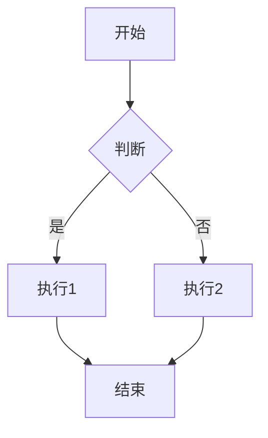
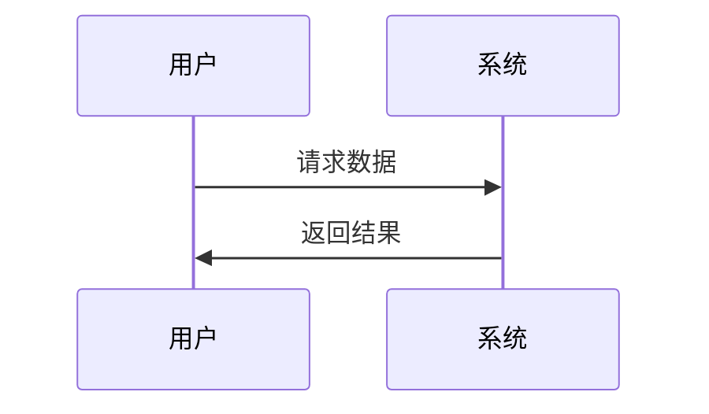
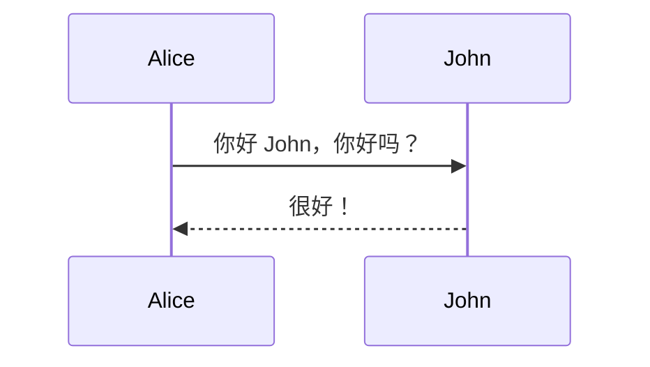
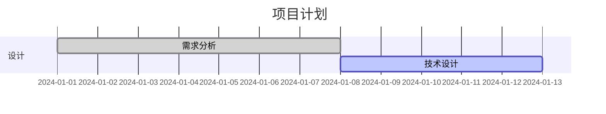

这个 `mermaid.vim` 插件是一个在 Neovim 中预览 Mermaid 图表的工具。让我为你详细介绍：

## 插件功能

**Mermaid 是一个图表绘制工具**，支持：

- 📊 **流程图** (Flowchart)
- 📅 **序列图** (Sequence Diagram)
- 🎯 **甘特图** (Gantt)
- 🏗️ **类图** (Class Diagram)
- 📈 **状态图** (State Diagram)
- 等等...

## 主要功能

| 功能             | 描述                            |
| ---------------- | ------------------------------- |
| **实时预览**     | 在浏览器中预览 Mermaid 图表     |
| **语法高亮**     | 为 Mermaid 代码提供语法高亮     |
| **文件类型支持** | 支持 Markdown 和纯 Mermaid 文件 |
| **快速操作**     | 通过快捷键快速预览和停止        |

## 使用方法

### 1. **编写 Mermaid 代码**

在 Markdown 文件中：



或者在 `.mermaid` 文件中：



### 2. **使用快捷键**

- `<leader>mp` - **预览图表**（在浏览器中打开）
- `<leader>ms` - **停止预览**（关闭预览）

### 3. **常用图表类型示例**

**流程图：**


**序列图：**



**甘特图：**



## 配置优化建议

你的配置已经很好了，这里是一些可选的增强配置：

```lua
return {
  "mracos/mermaid.vim",
  ft = { "markdown", "mermaid" },
  config = function()
    -- Mermaid 配置
    vim.g.mermaid_default_config = {
      startOnLoad = true,
      theme = "default", -- 可选: "default", "forest", "dark", "neutral"
      flowchart = {
        useMaxWidth = false,
        htmlLabels = true,
        curve = "basis", -- 连线样式
      },
      sequence = {
        diagramMarginX = 50,
        diagramMarginY = 10,
        actorMargin = 50,
      },
      -- 更多配置选项...
    }

    -- 启用语法高亮
    vim.g.vim_mermaid_initialized = 1

    -- 快捷键映射
    vim.keymap.set("n", "<leader>mp", ":MermaidPreview<CR>", {
      desc = "Preview mermaid diagram",
      buffer = true, -- 只在相关文件类型中生效
    })
    vim.keymap.set("n", "<leader>ms", ":MermaidStop<CR>", {
      desc = "Stop mermaid preview",
      buffer = true,
    })
    vim.keymap.set("n", "<leader>mc", ":MermaidCompile<CR>", {
      desc = "Compile mermaid to image", -- 如果有这个功能的话
      buffer = true,
    })
  end,
}
```

## 工作流程示例

### **场景 1：在 Markdown 中绘制架构图**

1. 在 Markdown 文件中编写 Mermaid 代码块
2. 将光标放在代码块内
3. 按 `<leader>mp` 在浏览器中预览
4. 调整代码直到满意
5. 按 `<leader>ms` 关闭预览

### **场景 2：专门的图表文件**

1. 创建 `architecture.mermaid` 文件
2. 编写复杂的系统架构图
3. 使用预览功能检查效果
4. 导出为图片或保留源代码

## 依赖要求

确保你的系统有：

- **现代浏览器**（Chrome、Firefox、Safari 等）
- **Python 3**（某些预览功能可能需要）
- **Node.js**（可选，用于高级功能）

## 使用技巧

1. **主题切换** - 尝试不同的 `theme` 选项找到喜欢的风格
2. **响应式设计** - 设置 `useMaxWidth` 控制图表宽度
3. **离线使用** - 如果经常使用，可以考虑配置离线渲染
4. **导出功能** - 查看插件是否支持导出为 PNG/SVG

## 常见问题解决

**如果预览不工作：**

- 检查浏览器是否安装
- 确认防火墙没有阻止本地服务器
- 查看插件是否有错误信息

**如果语法高亮不正常：**

- 确认文件类型正确设置
- 检查是否有其他插件冲突

这个插件对于编写技术文档、系统设计文档非常有用，能让你在 Neovim 中直接绘制和预览专业图表！
